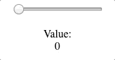

# Tiny Tween JS

Tiny Tween - A tiny (~5KB) JS Component for tweening values easily


Try it on [Codepen](https://codepen.io/yotamtal/pen/eaLYXd)



## Installation

Using package managers
```sh
yarn add tiny-tween-js

# OR

npm install tiny-tween-js
```
And include in your JS
```js
import TinyTween from 'tiny-tween-js' // ES6
```

OR 

Manually add as script
```html
<script src="//unpkg.com/tiny-tween-js"></script>
```

And get the exposed class:
```js
new window.TinyTween
```

## Usage

```js

const tweenOptions = { 
    target: document.getElementById('example'), // Optional target for value changes
    from: {'style.opacity': 0}, // FROM values to tween
    to: {'style.opacity': 100}, // TO values to tween
    duration: 2000, // In Milliseconds
    loop: true,  // Loop tween
    yoyo: true, // Play forward and then reverse to inital value
    autostart: false,
    ease: 'easeInOutCubic', // Easing effect, default is Linear
    onUpdate: function(val){},
    onComplete: function(){},
};

// ES6 Usage
import TinyTween from 'tiny-tween-js'
let tween = new TinyTween(tweenOptions);

// Vanilla Usage
let tween = new window.TinyTween(tweenOptions);

tween.play(); // Play tween from current state
tween.pause(); // Pause tween at current state
tween.stop(); // Stop playing and reset
tween.seek(0.50); // Set progress of tween
tween.destroy() // destroy instance to free memory
```

## TODO

- [x] Add seek method
- [ ] Chain tweens

## Credits

Easing functions Taken from https://gist.github.com/gre/1650294

